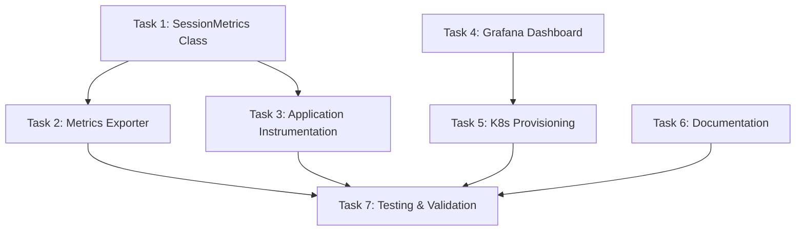

# Task Breakdown - Issue #5

## Task Overview



## Task 1: Create SessionMetrics Class ⚡ CRITICAL PATH

**File**: `src/lib/telemetry.ts`

**Objective**: Extend the existing Metrics module with session-specific metrics instruments.

**Scope**:
- Add SessionMetrics class with 7 new metrics:
  - `gwa_sessions_completed_total` (Counter)
  - `gwa_session_duration_seconds` (Histogram)
  - `gwa_tool_calls_total` (Counter)
  - `gwa_questions_asked_total` (Counter)
  - `gwa_questions_answered_total` (Counter)
  - `gwa_question_response_seconds` (Histogram)
  - `gwa_commits_created_total` (Counter)
  - `gwa_agent_tasks_total` (Counter)
- Export methods:
  - `recordSessionComplete(repo, status, type, durationSeconds)`
  - `recordToolCall(toolName, sessionId, success)`
  - `recordQuestionAsked(repo)`
  - `recordQuestionAnswered(repo, latencySeconds)`
  - `recordCommitCreated(repo, sessionId)`
  - `recordAgentTaskComplete(status, agentType)`

**Acceptance Criteria**:
- [ ] All 7 metrics defined with correct types and attributes
- [ ] Methods properly emit to OTLP
- [ ] Graceful error handling (try/catch)
- [ ] TypeScript types exported
- [ ] No breaking changes to existing Metrics class

**Estimated Complexity**: Medium (100-150 LOC)

**Depends On**: None

**Blocks**: Task 2, Task 3

---

## Task 2: Create Metrics Exporter Background Job

**File**: `src/lib/metrics-exporter.ts` (NEW)

**Objective**: Background process that exports database metrics to OTEL every 60 seconds.

**Scope**:
- Create `exportDatabaseMetrics()` function
- Query SQLite for:
  - Completed sessions since last export
  - Tool calls since last export
  - Questions answered since last export
  - Commits created since last export
  - Agent tasks completed since last export
- Emit metrics via SessionMetrics class
- Track last export timestamp in memory (or `config` table)
- Handle batch queries (100 rows at a time)
- Start interval timer on app init

**Integration Points**:
- Call from `src/orchestrate.ts` on startup: `startMetricsExporter()`
- Graceful shutdown: stop interval on SIGTERM

**Acceptance Criteria**:
- [ ] Queries only fetch records since last export (no duplicates)
- [ ] Batching prevents memory issues on large result sets
- [ ] Errors logged but don't crash process
- [ ] Can be disabled via env var `DISABLE_METRICS_EXPORT=true`
- [ ] Exported function `startMetricsExporter()` and `stopMetricsExporter()`

**Estimated Complexity**: Medium (150-200 LOC)

**Depends On**: Task 1

**Blocks**: Task 7

---

## Task 3: Instrument Application Code 🔧 HIGH IMPACT

**Files**:
- `src/orchestrate.ts`
- `src/lib/repl-session.ts`
- `src/respond.ts`
- `src/cleanup.ts`
- Swarm handlers (if applicable)

**Objective**: Add metric recording calls at key lifecycle points.

**Scope**:

### `src/orchestrate.ts`
- After session completes, calculate duration and call:
  ```typescript
  SessionMetrics.recordSessionComplete(
    repo,
    session.status, // "complete" | "error" | "interrupted"
    session.type,   // "feature" | "pr" | "review"
    durationSeconds
  );
  ```

### `src/lib/repl-session.ts`
- Hook into Claude CLI JSON output stream
- On each tool_use message, call:
  ```typescript
  SessionMetrics.recordToolCall(
    toolName,
    sessionId,
    success
  );
  ```
- On commit detected, call:
  ```typescript
  SessionMetrics.recordCommitCreated(repo, sessionId);
  ```

### `src/respond.ts`
- When answer received, calculate latency and call:
  ```typescript
  const latency = (answeredAt - askedAt) / 1000;
  SessionMetrics.recordQuestionAnswered(repo, latency);
  ```

### `src/cleanup.ts`
- When marking session as interrupted, emit metrics same as orchestrate

### Swarm handlers
- On agent task completion:
  ```typescript
  SessionMetrics.recordAgentTaskComplete(status, agentType);
  ```

**Acceptance Criteria**:
- [ ] All 6 lifecycle points instrumented
- [ ] No performance regression (metrics emit is async)
- [ ] Existing functionality unchanged
- [ ] Error handling prevents metrics from crashing sessions

**Estimated Complexity**: Medium (50-100 LOC across files)

**Depends On**: Task 1

**Blocks**: Task 7

---

## Task 4: Create Grafana Dashboard JSON 📊 STANDALONE

**File**: `k8s/grafana/dashboards/session-metrics.json` (NEW)

**Objective**: Design comprehensive dashboard with 12+ panels.

**Scope**:

### Dashboard Configuration
- Title: "GWA Session Metrics"
- UID: `gwa-sessions`
- Tags: `["gwa", "sessions", "claude"]`
- Refresh: 30s
- Time range: Last 24 hours (default)

### Template Variables
- `$repo` - Multi-select dropdown of all repositories
- `$time_range` - Quick time range selector (5m, 1h, 6h, 24h, 7d)

### Panels (Row 1 - Overview)
1. **Active Sessions** (Stat) - `gwa_sessions_active`
2. **Success Rate (24h)** (Gauge) - Calculated success percentage
3. **Total Sessions Today** (Stat) - Count of completed sessions
4. **Avg Session Duration** (Stat) - p50 from histogram

### Panels (Row 2 - Session Outcomes)
5. **Session Status Distribution** (Pie Chart)
6. **Sessions Over Time** (Graph) - Stacked by status
7. **Error Rate Trend** (Graph) - Error sessions per hour

### Panels (Row 3 - Performance)
8. **Session Duration p95** (Graph) - 95th percentile trend
9. **Duration Histogram** (Heatmap) - Visual distribution
10. **Long-Running Sessions** (Table) - Sessions >1 hour

### Panels (Row 4 - Activity)
11. **Tool Usage Frequency** (Bar Chart) - Top 10 tools
12. **Commits Per Hour** (Graph) - Commit rate
13. **Questions Asked/Answered** (Graph) - Interactive session rate

### Panels (Row 5 - Drill-Down)
14. **Top Active Repositories** (Table) - Sessions per repo
15. **Question Response Latency** (Graph) - p95 answer time
16. **Agent Task Success Rate** (Gauge) - Swarm effectiveness

**Acceptance Criteria**:
- [ ] All 16 panels defined with valid PromQL
- [ ] Template variables work correctly
- [ ] Panel descriptions explain metrics
- [ ] Consistent color scheme (green=good, red=bad)
- [ ] Mobile-responsive layout
- [ ] Dashboard JSON validates with Grafana schema

**Estimated Complexity**: High (500-800 LOC JSON)

**Depends On**: None (can design against expected metrics)

**Blocks**: Task 5

---

## Task 5: Create Kubernetes ConfigMap Provisioning

**File**: `k8s/grafana/configmap-dashboards.yaml` (NEW)

**Objective**: Auto-provision dashboard to Grafana on deployment.

**Scope**:
- Create ConfigMap with label `grafana_dashboard: "1"`
- Namespace: `grafana` (or wherever Grafana is deployed)
- Embed `session-metrics.json` as data key
- Update deployment docs to apply ConfigMap

**ConfigMap Template**:
```yaml
apiVersion: v1
kind: ConfigMap
metadata:
  name: grafana-dashboard-gwa-sessions
  namespace: grafana
  labels:
    grafana_dashboard: "1"
data:
  session-metrics.json: |
    # Inline dashboard JSON here
```

**Deployment Integration**:
- Add to `scripts/deploy-all.sh` or similar
- Document in `docs/deployment.md`

**Acceptance Criteria**:
- [ ] ConfigMap applies without errors
- [ ] Grafana sidecar picks up dashboard automatically
- [ ] Dashboard appears in Grafana UI within 60s
- [ ] Updates to ConfigMap reflect in Grafana

**Estimated Complexity**: Low (50 LOC)

**Depends On**: Task 4

**Blocks**: Task 7

---

## Task 6: Write Documentation 📚 STANDALONE

**File**: `docs/metrics-dashboard.md` (NEW)

**Objective**: User-facing documentation for dashboard usage.

**Scope**:

### Sections to Include
1. **Overview** - What the dashboard shows
2. **Accessing the Dashboard** - URL and navigation
3. **Panel Explanations** - Each panel's purpose and interpretation
4. **Template Variables** - How to filter data
5. **Custom PromQL Queries** - Examples for power users
6. **Troubleshooting** - Common issues and fixes
7. **Alert Thresholds** - Recommended values for monitoring

### Example Queries Section
- Find sessions by specific tool usage
- Calculate average tools per session
- Identify repositories with high error rates
- Track question response SLA

**Acceptance Criteria**:
- [ ] All 16 dashboard panels documented
- [ ] At least 5 custom query examples
- [ ] Troubleshooting section covers common issues
- [ ] Screenshots of key panels (can be added post-deployment)
- [ ] Links to Grafana and Mimir docs

**Estimated Complexity**: Medium (200-300 LOC markdown)

**Depends On**: None (can write in parallel)

**Blocks**: Task 7

---

## Task 7: Testing & Validation ✅ FINAL

**Scope**: End-to-end validation of metrics pipeline and dashboard.

**Test Plan**:

### Unit Tests
- `src/lib/telemetry.test.ts` - Mock OTEL SDK, verify metric calls
- `src/lib/metrics-exporter.test.ts` - Mock DB, verify queries and emissions

### Integration Tests
1. **Local Validation**:
   - Run `bun run orchestrate` with test PR
   - Verify metrics appear in local OTEL collector logs
   - Check Mimir for metric presence

2. **Dashboard Validation**:
   - Import dashboard JSON to local Grafana
   - Generate sample data (run 10 test sessions)
   - Verify all panels display data
   - Test template variable filtering

3. **Performance Testing**:
   - Measure orchestration runtime before/after instrumentation
   - Verify metrics overhead <5%
   - Check memory usage of background exporter

### Production Validation
- Deploy to dev cluster
- Run 20 sessions with mixed outcomes
- Verify dashboard shows correct counts
- Check metric cardinality (ensure <1000 unique series)
- Monitor Alloy/Mimir logs for errors

**Acceptance Criteria**:
- [ ] All unit tests pass
- [ ] Integration tests show metrics flowing correctly
- [ ] Dashboard displays accurate data
- [ ] No performance degradation
- [ ] No errors in Alloy/Mimir logs
- [ ] Metric cardinality within limits

**Estimated Complexity**: High (testing infrastructure + validation)

**Depends On**: Task 2, Task 3, Task 5, Task 6

**Blocks**: None (final task)

---

## Parallelization Strategy

### Phase 1: Foundation (Start in parallel)
- **Task 1**: SessionMetrics class (critical path)
- **Task 4**: Dashboard design (independent)
- **Task 6**: Documentation (independent)

### Phase 2: Implementation (After Task 1 completes)
- **Task 2**: Metrics exporter (depends on Task 1)
- **Task 3**: Application instrumentation (depends on Task 1)

### Phase 3: Deployment (After Task 4 completes)
- **Task 5**: ConfigMap provisioning (depends on Task 4)

### Phase 4: Validation (After all others)
- **Task 7**: Testing and validation

**Total Estimated Time**: With parallelization, 3-4 phases can complete in sequence rather than 7 sequential tasks.

---

## Risk Mitigation

### Risk: High Metric Cardinality
- **Mitigation**: Limit `repo` label to top 50 repositories using Alloy relabeling
- **Detection**: Monitor Mimir series count
- **Fallback**: Drop `session_id` from tool_calls metric if needed

### Risk: Database Query Performance
- **Mitigation**: Use indexed columns (`completed_at`, `created_at`) in WHERE clauses
- **Mitigation**: Batch queries at 100 rows max
- **Detection**: Log query execution time
- **Fallback**: Increase export interval to 120s

### Risk: Dashboard Performance
- **Mitigation**: Use time range filters in PromQL
- **Mitigation**: Limit table panels to 20 rows
- **Detection**: Monitor Grafana query duration
- **Fallback**: Add caching to dashboard JSON

### Risk: OTLP Export Failures
- **Mitigation**: All metric calls wrapped in try/catch
- **Mitigation**: Metrics are optional (won't crash sessions)
- **Detection**: Log OTLP errors
- **Fallback**: Disable metrics exporter via env var

---

## Definition of Done

All tasks complete when:
- ✅ All code merged to main branch
- ✅ Dashboard visible in Grafana UI
- ✅ Documentation published
- ✅ Integration tests passing
- ✅ No production incidents related to metrics
- ✅ Team demo completed showing dashboard usage
